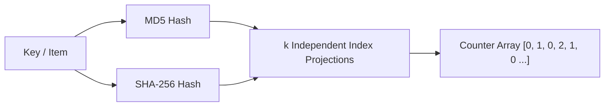

# Counting Bloom Filter with Safe Deletion Skill

High-efficiency, zero-dependency Python implementation of a **Counting Bloom Filter (CBF)** supporting concurrent insertions, membership tests, and exact item deletions without false negative degradation.

## Features
- **Item Deletion Support**: Integer counter arrays prevent false negatives when items are evicted from the set.
- **Double-Hashing Optimization**: Synthesizes \(k\) distinct hash buckets from combined MD5 and SHA-256 projections.
- **Zero External Dependencies**: Pure Python standard library (`hashlib`).
- **Native MCP Protocol**: JSON-RPC 2.0 stdio server compatible with Claude Desktop, Cursor, and Windsurf.

## Architecture

